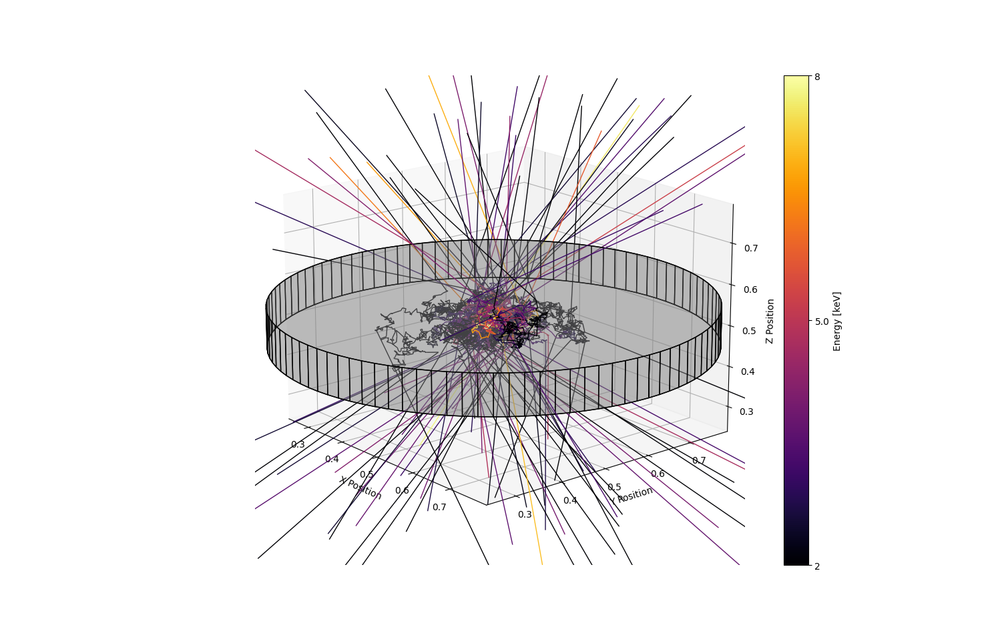
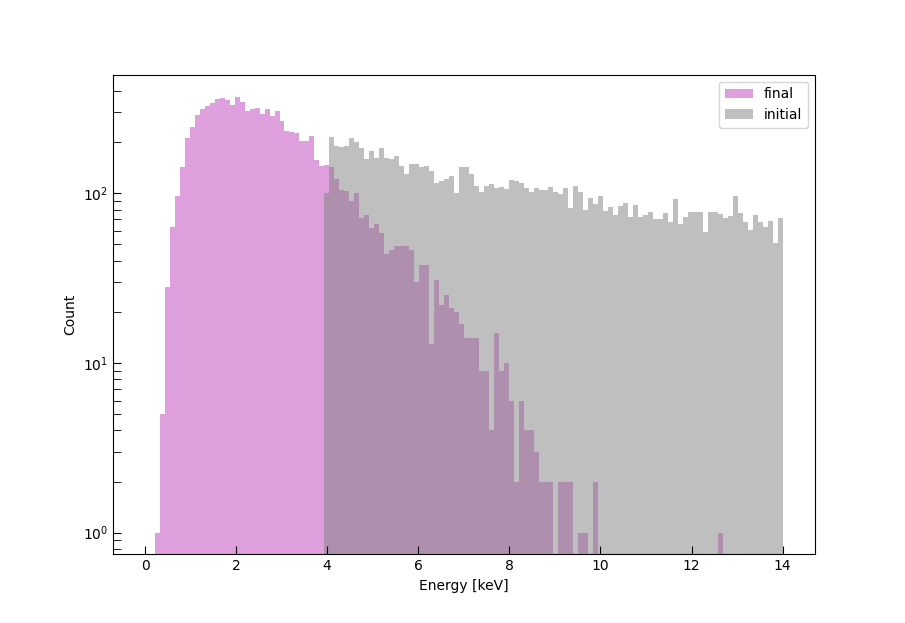

# COMPTONICE
COMPTONICE computes radiative transfer of photons interacting with gas via Compton scattering. Photon positions and energies are evolved through a grid sampling a density medium of arbitrary complexity.  

<em> Fig. 1: Photon trajectories through a Compton thick disc. The colour shows the photon energy. </em>

<em> Fig. 1: Initial spectrum (grey) and spectrum after Comptonisation (pink). </em>
